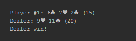
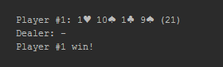
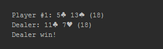
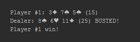
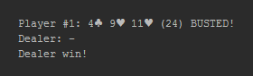
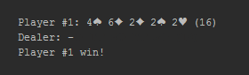

## Tjugoett

>###OBS! OBS! OBS!
- Detta är en __obligatorisk__ och __examinerande__ uppgift som __du ska lösa helt på egen hand__.
- Du måste göra __regelbundna "commits" och "pushes"__ av koden till ditt repositorium för uppgiften för att kursledningen ska kunna följa ditt arbete med uppgiften.
- Du ska kunna förklara alla konstruktioner och satser som din lösning av uppgiften innehåller.  

###Introduktion till uppgiften
I denna examinationsuppgift ska du simulera kortspelet Tjugoett enligt givna regler.

Du kommer att ha stor frihet välja hur du vill lösa uppgiften; vilka konstruktioner att använda. Hur representeras lämpligen en kortlek om 52 kort? Behöver data kasplas in så att egenskaper behövs? Hur många klasser behöver skapas?  Är arv lämpligt att använda i något sammanhang? Vilka metoder behövs? Ska metoderna vara statiska eller inte? Överskuggning?

###Regler

#### Kort
En vanlig kortlek om 52 kort används. Esset är värt 1 eller 14 poäng, en kung är värd 13, en dam 12, en knekt 11 och övriga kort sin valör.

#### Spelet idé
I Tjugoett gäller det att komma till, eller så nära som möjligt, summan 21 på två eller flera kort. 

#### Exempel
Given ger alla spelare ett kort var från draghögen. Given tar inte själv något kort. Spelarna spelar nu mot given en i taget i turordning. När det är en spelares tur begär spelaren ett kort av given. Efter spelarens andra kort kan något av följande inträffa:

1. Spelaren har fått 21 och vinner.
2. Spelaren har spruckit, d.v.s. fått en summa större än 21, och förlorar.
3. Spelaren begär ytterligare kort tills summan är 21, större än 21 eller förklara sig nöjd.

Då en spelare förklarat sig nöjd är det givens tur att försöka straffa spelaren. Given drar kort från draghögen, ett efter ett, och något av följande kan inträffa:

1. Given får 21 och vinner.
2. Given spricker och spelaren vinner.
3. Given förklarar sig nöjd. Spelaren och given jämför sina händers summor och den som har högst vinner. Om summorna är lika vinner given.

Given forsätter sedaan att spela mot näste spelare på samma sätt. Tar korten i fraghögen slut, det understa kortet används aldrig, tar given alla dittills avverka kort, blandar om dem använder dem som en ny draghög.

###Uppgift
Du ska skriva en konsol- eller webbapplikation i C# som simulerar kortspelet Tjugoett enligt givna regler.Inget hasardmoment, d.v.s. ingen satsning av pengar, behöver förekomma. Du väljer själv om det ska vara en eller flera spelare utöver given. Ingen interaktion med användare behöver finnas utan både spelare och giv kan dra kort från draghögen enligt en förutbestämd algoritm utformad enligt ditt eget tycke. Exempelvis kan du välja att en spelare är nöjd då summan uppgår till 15 (eller mer konservativt, och hållbarare i längden, 8). 

Din applikation måste innefatta minst tre egendefinierade klasser eller strukturer, som objekt instansieras av. Samtliga typer ska vara placerade i olika filer. Du väljer själv vad typerna ska representera. Kanske skapar du typer för spelbord, draghög, giv, spelare, hand, spelkort, färg, valör, ...?    

Efter varje spelomgång ska resultatet presenteras. Det ska framgå vilka kort spelare och giv dragit, respektive hands summa och vem som vunnit. Bilderna nedan är _förslag_ på presentation av resultatet av olika spelomgångar.

###Bedömning
Bedömning av examinationsuppgiften görs enligt skalan U/G/VG. För att få VG i slutbetyg krävs VG på denna examinationsuppgift, samt G på examinationsuppgift 1 och 2.

Samtliga mål i kursplanen examineras, men framför allt det tredje och fjärde målet, _"Välja relevanta programstrukturer (metoder, klasser, etc.) för att lösa programmeringsuppgifter. (3)"_ samt
_"Med utgångspunkt från en beskrivning av ett mindre problem kunna välja och konstruera en algoritm som löser problemet. (4)"_. __Du ska under muntliga examinationen av examinationsuppgiften motivera dina _aktiva(!!?)_ val du gjort beträffanade datastrukturer och algoritmer.__

Betygsgraden bestäms utifrån hur väl du kan visa att du tillgodogjort dig kursens samtliga moment och den praktiska tillämpning av dessa. Utökningar av uppgiften kan premieras.

###Tips
Ett vanligt sätt att representera en kortlek är att använda en samling av lämpligt slag. För att blanda elementen i samlingen brukar algoritmen _Fisher-Yates Shuffle_ användas i en eller annan form. 
